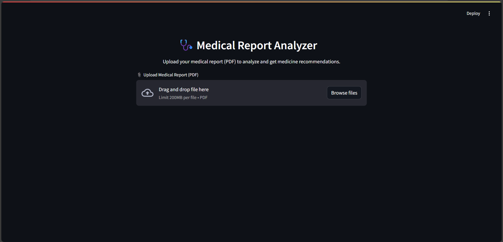
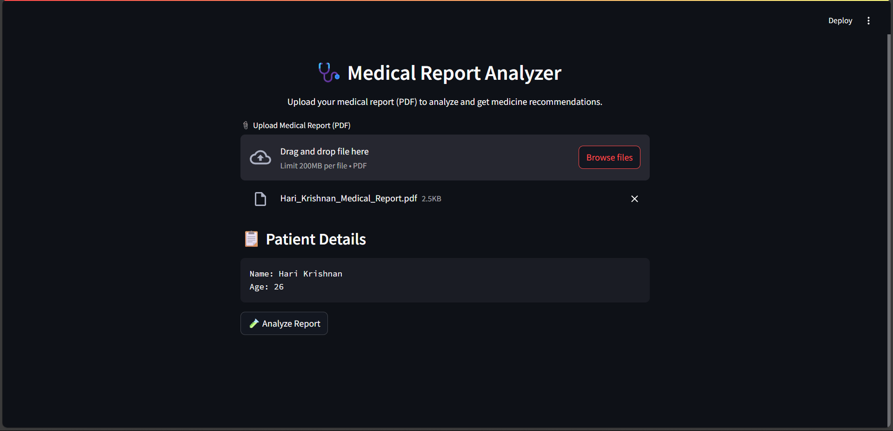
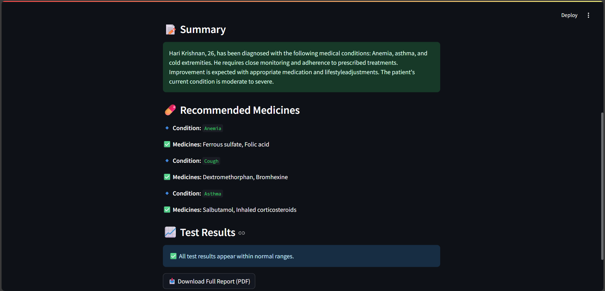

# 🩺 Medical Report Analyzer

## 🚀 Overview
The **Medical Report Analyzer** is a Streamlit-based web application that analyzes medical reports in PDF format. It extracts key information such as **patient details**, **summarizes medical content using AI**, **detects medical conditions**, and **provides medicine recommendations**. It also identifies **abnormal test results** and generates a downloadable **PDF report**.

## ✅ Features
- 📎 **Upload medical reports in PDF format**  
- 👤 **Extract patient name and age**  
- 📝 **Summarize medical content using Hugging Face models via LangChain**  
- 💊 **Detect medical conditions and provide recommended medicines**  
- 📈 **Identify abnormal test results**  
- 📄 **Generate a comprehensive PDF report with all extracted details**  

## ⚙️ Installation
Ensure Python is installed, then install dependencies:

```bash
pip install streamlit langchain-community fpdf pymupdf torch transformers
```
## ▶️ How to Run
- Clone or download the project.
- Install the required dependencies.
- Open VS Code and load medical-report-analyzer.code-workspace.
- Run the Streamlit app:
```bash
streamlit run app.py
```
## 📌 Usage
- 📎 Upload a medical report (PDF).
- 🚀 Click "Analyze Report" to extract and process the data.
- 📝 View summarized medical text, detected conditions, and recommended medicines.
- 📈 See abnormal test results for deeper insights.
- 📥 Download the generated PDF report for reference.

## 🏗️ Technologies Used
- 💻 Streamlit - Interactive web interface
- 🧠 LangChain - AI-powered text summarization
- 📑 PyMuPDF - PDF text extraction
- 📄 FPDF - PDF report generation
- 🤖 Transformers - Deep learning-based text processing
- 🔥 Torch - Machine learning framework for AI model support

## 📸 Screenshots






## 🔮 Future Enhancements
- 🔍 Support for extracting more medical parameters
- ✅ Improve accuracy of condition detection
- 🏥 Expand medicine recommendations
- 📊 Provide visualizations for test results

## ✍️ Author
👤 Akshai Das

📧 akshaidas781@gmail.com

🔗 [LinkedIn profile](https://www.linkedin.com/in/akshai-das-815668273/?originalSubdomain=in)


